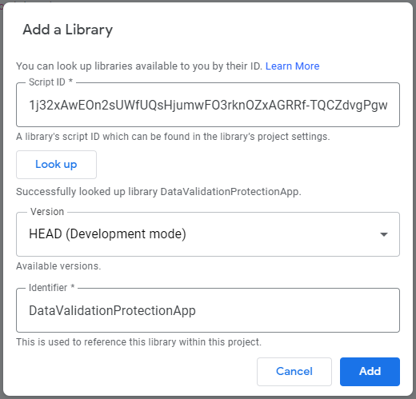

# Data Validation Protection

DVP is a utility library for Google Apps Script that makes protecting, unprotecting, and manipulating data validations in Google Sheets easy and convenient.

# Usage

The library exposes the following methods (accessible via the `userSymbol` you included it as):

| Method                 | Description                                                                    |
| ---------------------- | ------------------------------------------------------------------------------ |
| `getInstance(<sheet>)` | Instantiates the utility class given a Google Sheets sheet                     |
| `setPrefix(<prefix>)`  | Sets the prefix to prepend when naming new data validations (`DVP` by default) |
| `wrap(<protection>)`   | Wraps a built-in protection into internal `Protection` class instance          |

Upon obtaining an instance of `DataValidationProtection` class, the following instance methods become available:

| Method                                      | Description                                                                             |
| ------------------------------------------- | --------------------------------------------------------------------------------------- |
| `getColumn([column=1])`                     | Gets data validation protections at a given column                                      |
| `getRow([row=1])`                           | Gets data validation protections at a given row                                         |
| `list()`                                    | Lists all data validation protections                                                   |
| `protect([skip=1])`                         | Adds data validation protection                                                         |
| `protectColumnsExcept(<index[]>, [skip=1])` | Adds data validation protection to columns except those specified (indexes are 0-based) |
| `unprotect()`                               | Removes data validation protection                                                      |
| `addToColumn(<column>, [...emails])`        | Adds editors to a column of data validations                                            |
| `addToRow(<row>, [...emails])`              | Adds editors to a row of data validations                                               |
| `removeFromColumn(<column>, [...emails])`   | Removes editors from a column of data validations                                       |
| `removeFromRow(<row>, [...emails])`         | Removes editors from a row of data validations                                          |
| `addEditors([...emails])`                   | Adds editors to the data validation protection                                          |
| `removeEditors([...emails])`                | Removes editors from the data validation protection                                     |

An internal `Protection` class instance, obtained via the `wrap` method, exposes the following instance methods:

| Method                             | Description                                                                  |
| ---------------------------------- | ---------------------------------------------------------------------------- |
| `isProtectedCell(<row>, <column>)` | Checks if a given protection applies to coordinates                          |
| `getRange()`                       | Returns an instance of `Range` class the protection is set on (proxy method) |
| `addEditor(<email>)`               | Adds an editor to protection (proxy method)                                  |
| `removeEditor(<email>)`            | Removes an editor from protection (proxy method)                             |
| `removeEditors()`                  | Removes all editors from protection                                          |

# Install

> Latest library version: 6

If developing locally, add the project info to manifest file's `dependencies.libraries` list:

| Field             | Required | Value                                                                    |
| ----------------- | -------- | ------------------------------------------------------------------------ |
| `libraryId`       | yes      | `1j32xAwEOn2sUWfUQsHjumwFO3rknOZxAGRRf-TQCZdvgPgwzJ2m4tptx`              |
| `version`         | yes      | Library version you want to use                                          |
| `userSymbol`      | no       | The library name, `DataValidationProtectionApp` by default               |
| `developmentMode` | no       | Include the library in dev mode (will use any latest _unstable_ version) |

Sample JSON object to add:

```json
{
    "libraryId": "1j32xAwEOn2sUWfUQsHjumwFO3rknOZxAGRRf-TQCZdvgPgwzJ2m4tptx",
    "userSymbol": "DataValidationProtectionApp",
    "version": "6",
    "developmentMode": false
}
```

Otherwise, use the new online editor UI to add the library (the id is the same as in `libraryId`):


